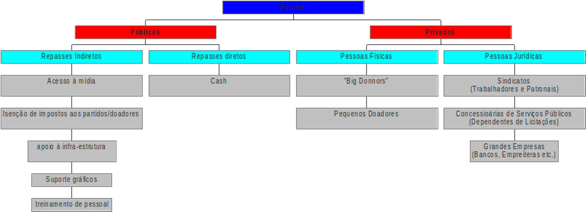
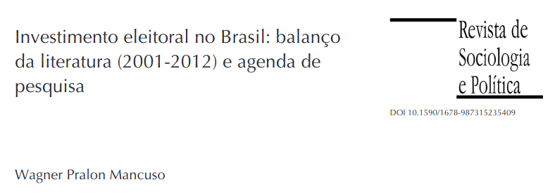
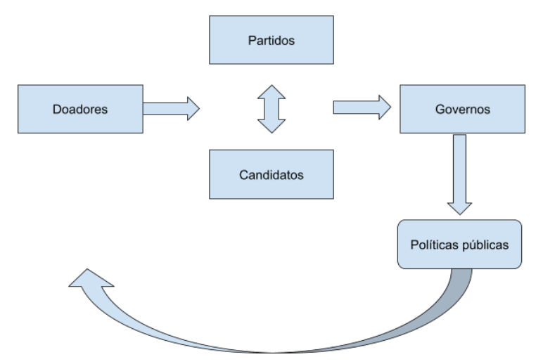
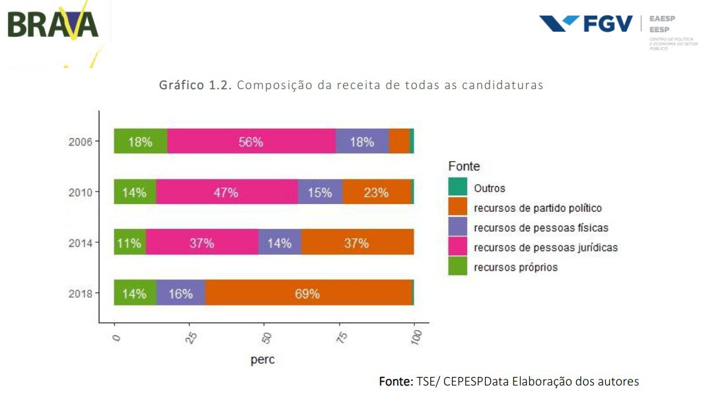
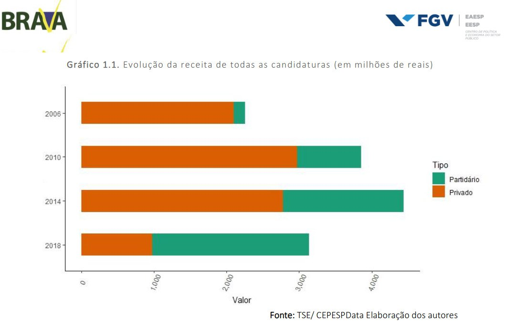
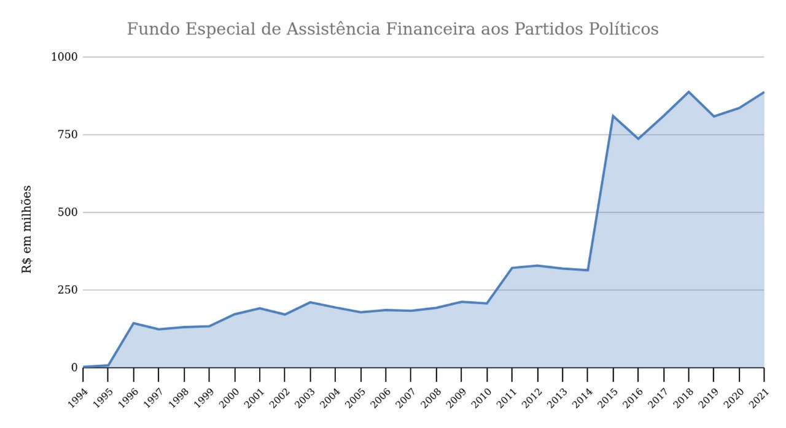
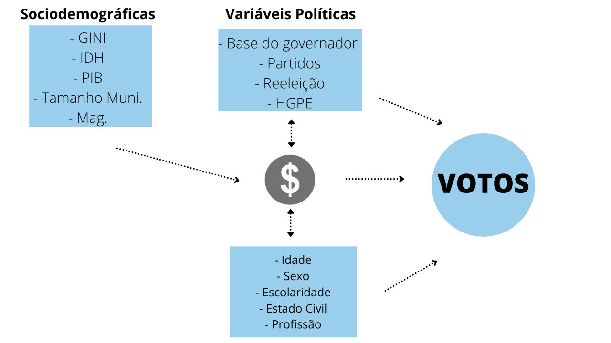

```{r setup, include=FALSE}
options(htmltools.dir.version = FALSE)
```


# Objetivos


- Sobrevoo nos estudos sobre financiamento 

- Problemas de pesquisas

- Financiamento das eleições municipais


---
# Esquema teórico: Regulação dos sistemas de financiamento dos partidos e eleições

- Controle do Processo Eleitoral 

- Independência das Agências 

- Produção de Informação

- Garantir competitividade

- Garantir liberdade

- Prevenir interferências nas “prioridades” parlamentares (acesso privilegiado)

---
# Tipos de recursos


```{r, echo=FALSE, out.width= "100%"}
knitr:: 
```


---
# Problemas de pesquisa


(a) comparação de modelos de financiamento 


(b) relação entre investimento e desempenho eleitoral 


(c) relação entre investimento e concessão de benefícios para os financiadores 


(d) determinantes do investimento eleitoral


--
```{r, echo=FALSE}

knitr:: 

```

---
# Modelos analíticos


```{r, echo=FALSE, out.width= "100%"}
knitr:: 
```

---
# Mudanças nas regras eleitorais

- Proibição de recursos provenientes de sociedades de economia mista e de concessionários de serviço público (Lei nº 1.164 de 1950).

- Instituição do Fundo Partidário e proibições empresas privadas de finalidade lucrativa (Lei nº 4.740 de 1965).

- Legalização formal da participação de empresas no financiamento (Regulação das eleições de 1994 - Lei nº 8.713 de 1993 )

- Proibição de brindes e "showmicios" (Lei nº 11.300 DE 2006 -Minirreforma Eleitoral) 

- Proibição do financiamento de empresas (Ação Direta de Inconstitucionalidade ADI 4.650)

- Cláusula de barreira para acesso ao fundo partidário (Emenda Constitucional nº 97/2017)

- Fundo Especial de Financiamento de Campanha (FEFC- Lei nº 13.487)

- Cotas para financiamento de mulheres e negros (Decisões do TSE/STF) 

---

```{r, echo=FALSE}



```

Fonte:
"Os Custos da Campanha Eleitoral no Brasil: Uma análise baseada em evidência" 
Autores: Ciro Biderman, George Avelino, Jonathan Phillips, Lara Mesquita, Natália Salgado Bueno

FGV - CEPESP Data
---


```{r, echo=FALSE}



```


Fonte:
"Os Custos da Campanha Eleitoral no Brasil: Uma análise baseada em evidência" 
Autores: Ciro Biderman, George Avelino, Jonathan Phillips, Lara Mesquita, Natália Salgado Bueno

FGV - CEPESP Data
---
# Fundo Especial de Assistência Financeira aos Partidos Políticos

```{r, echo=FALSE}



```

---
# Clausula de barreira para acesso ao fundo partidário 

Partidos que na legislatura seguinte ao pleito de 2018, obtiveram no mínimo 1,5% dos votos válidos nas eleições para a Câmara dos Deputados, distribuídos em pelo menos um terço das unidades da Federação, com um mínimo de 1% (um por cento) dos votos válidos em cada uma delas. Ou as que elegeram pelo menos nove deputados federais distribuídos em pelo menos um terço das 27 unidades da Federação.


---
# Fundo Especial de Financiamento de Campanha (FEFC)


-  48% divididos entre os partidos na proporção do número de representantes na Câmara dos Deputados na última eleição geral;

- 35% divididos entre os partidos na proporção do percentual de votos válidos obtidos pelas siglas que tenham pelo menos um representante na Câmara;

- 15% divididos entre os partidos na proporção do número de representantes no Senado;

- 2% divididos igualmente entre todos os partidos registrados no TSE.


Em 2018 foram distribuídos 1,7 bilhões e, em 2020, outros 2 Bilhões


---
# Eleições municipais 


```{r, echo=FALSE, out.width= "100%"}

```

      

---
# Exercício

- Buscar nos sites dos partidos critério que devem ser informados ao TSE sobre a distribuição do Fundo Eleitoral de 2020


